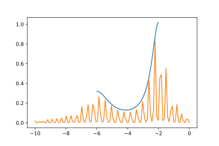

Spectrojotometer.
=================

This package is a set of tools to determine, by means of ab initio 
simulations, the value of the coupling constants in a Heisenberg-like effective 
magnetic model for a given magnetic system.

A ready to use version for MS Windows is available [here](http://www2.fisica.unlp.edu.ar/~matera/visualbond/)

Instalation:
============

To install the package, just run

python3 setup.py install

Tools in the package and workflow:
==================================

The package consists of these three command line programs:

*) bond_generator: 

   From an standard cif file, produces a new cif file containing information
   about the bonds that defines a Heisenberg magnetic effective model. If the
   input file has already information about bonds, the output file contains both
   the bonds in the input as well as the new generated bonds.

   usage: bond_generator [-h] [--discretization [value]] [--rmin [value]]
                         [--rmax [value]]
                         ciffile outfile

   positional arguments:
     ciffile               load atomic positions from a cif file
     outfile               Name of the outputfile. If it is not provided, the
                        output is printed to the standard output.

   optional arguments:
     -h, --help            show this help message and exit
     --discretization [value]
                             the tolerance in considering two distances as the
                             same.
     --rmin [value]        the minimal distance between atoms of the bond
     --rmax [value]        the maximal distance between atoms of the bond

As an example, by run 

   bond_generator.py  --rmin 0 --rmax 4.9 --discretization .02  example1.cif example1-nnn.cif

   for the  example1.cif  file in the examples folder, example1-nnn.cif file is created. The model can be modified by hand
   by means of a plain text editor.

*) optconfs
    Generate spin configurations to determine the coupling constants of a model
    with minimal condition number
    
    
    usage: optconfs.py [-h] [--known [known configuration file]]
                       [--start [start file]] [-n numconfs] [-u updatesize]
                       [--it iterations]
                       ciffile outfile
    
    
    positional arguments:
      ciffile               load atomic positions from a cif file
      outfile               Name of the outputfile. If it is not provided, the
                            output is printed to the standard output.
    
    optional arguments:
      -h, --help            show this help message and exit
      --known [known configuration file]
                            file with the set of configurations that we want to
                            increase
      --start [start file]  A file containing an initial guess for the target
                            configurations.
      -n numconfs           number of new configurations to be generated
      -u updatesize         number of random configurations to be generate on each
                            step
      --it iterations       number of iterations
    
    
As an example, by run

   optconfs  example1-nnn.cif optconfs1.out
   
   on the examples/example1-nnn.cif generated by bond_generator, the file optconfs1.out is created, containing a list
   of magnetic configurations from which energies the coefficient couplings can be estimated. The program also writes
   a recovery file example1-nnn-resume.tmp, which can be used to improve the magnetic configuration choice:

   optconfs  --start example1-nnn-resume.tmp example1-nnn.cif optconfs1.out

   If we want to know what would be most profiteable magnetic configurations to be simulated once we have already simulated 
   a given set of configurations, we run

   optconfs  --known optconfs1.out example1-nnn-resume.tmp example1-nnn.cif optconfs2.out

   In this case, the program will try to provide the optimal configuration to be added to those in optconfs1.out.
   We can ask for an specific amount of new configurations throw the parameter -n.

*) evaluate_cc 

    From a set of energies and magnetic configurations, estimates the coupling
    constants of a model.
    
    
    
    usage: evaluate_cc.py [-h] [--tolerance [value]] [--showequations]
                          ciffile [input file]
    
    
    positional arguments:
      ciffile              load atomic positions from a cif file.
      [input file]         file containing evaluated energies and magnetic
                           configurations.
    
    optional arguments:
      -h, --help           show this help message and exit
      --tolerance [value]  Provides the estimated error for the energies.
      --showequations      Prints the resulting equations.

    Notice that in the input file, each line consists on the energy
    of a magnetic configuration, followed by the correspondent magnetic
    configuration as a list [0,1,0,...]. Anything after a # is considerer
    as a comment.
    For example, a possible input file would be
    
    # Energy  Configuration  Label
    143121.12   [0,0,0,0,0,0,0]  # Ferro up
    143121.02   [1,1,0,0,1,1,1]  # Disorder1
    143121.24   [1,0,1,1,1,1,0]  # Disorder2
    143121.12   [1,1,1,1,1,1,1]  # Ferro down

 

As an example, by run

   evaluate_cc  example1-nnn.cif optconfs2-en.in 

   we obtain

 Results:
==========

E_0 =  1022.8  +/-  0.001 

J3  =  0.000307570720896 * 1022.8  +/- 0.00592942475367
J2  =  -0.00107262742797 * 1022.8  +/- 0.00592942475367
J4  =  0.00102985269196 * 1022.8  +/- 0.00592942475367
J1  =  0.000721874592622 * 1022.8  +/- 0.00592942475367

 Error in Modeled Energy: 
==========================

34.1666666667
170.833333333
68.3333333335
68.3333333329
34.1666666666
34.1666666666

   an estimation of the coupling constants printed, according to the configurations and energies provided in the file optconfs2.in.
   The program also prints the list of differences between the input energies and the energies evaluated by the magnetic model
   for each configuration, relative to the tolerance. This is useful once we have a large enough number of evaluated configurations 
   to check the validity of the effective magnetic model. If some differences result larger than 1, it implies that the proposed 
   magnetic model is unable to reproduce the input spectrum.

   

